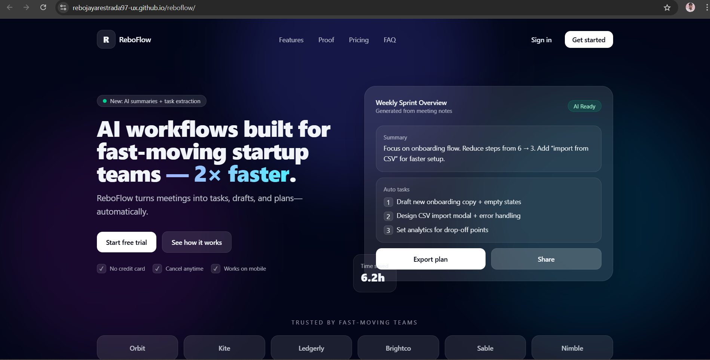

# ReboFlow

**AI SaaS landing page for fast-moving startup teams**

🔗 Live demo: https://rebojayarestrada97-ux.github.io/reboflow/

---

## Overview

ReboFlow is a modern AI SaaS landing page concept designed for startup teams.  
It focuses on clear messaging, strong visual hierarchy, and conversion-driven layout.

The goal of this project is to demonstrate product thinking, UI/UX structure, and clean frontend execution.

---

## Key Features

- AI-focused hero messaging
- Feature-driven layout with clear value props
- Social proof and testimonials
- Pricing section with billing toggle
- FAQ to reduce conversion friction
- Mobile-responsive design
- Glassmorphism UI style

---

## Tech Stack

- **HTML**
- **Tailwind CSS (CDN)**
- **Vanilla JavaScript**
- **GitHub Pages** for deployment

---

## What This Demonstrates

- SaaS landing page UX patterns
- Conversion-first layout decisions
- Responsive design fundamentals
- Clean, readable frontend structure
- Ability to ship and deploy a polished product

---

## Notes

This is a **portfolio concept project** (not a live SaaS).  
The structure, content, and design are intended to reflect real-world startup landing pages.

---

## Author

**Rebo Jay-ar Estrada**  
UI/UX & Frontend Designer
